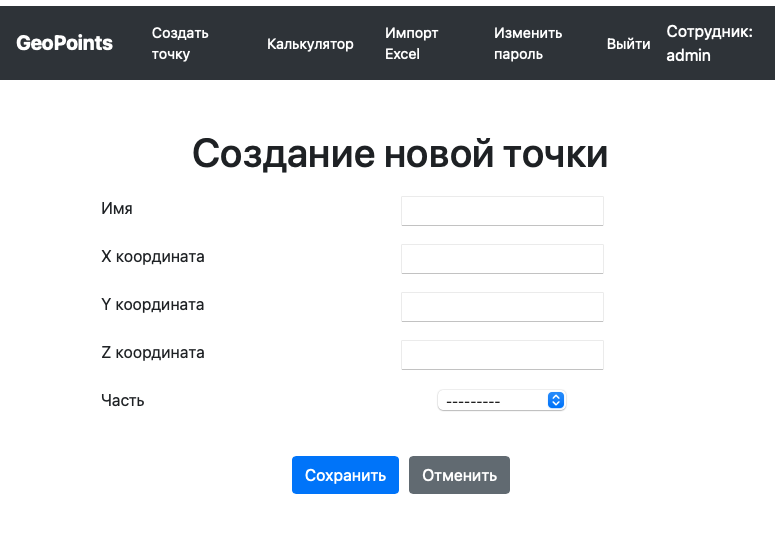
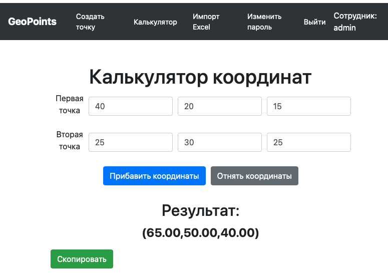
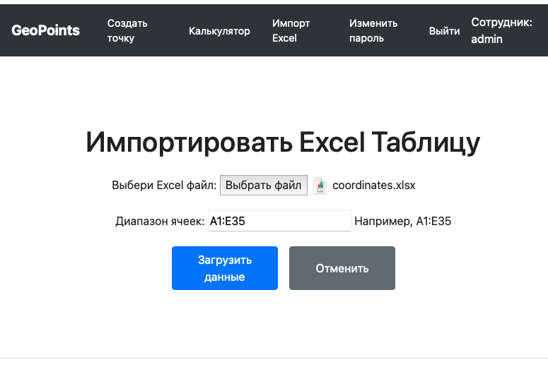

# GeoPoints
## Описание проекта
Проект GeoPoints выполнен согласно тестовому заданию. Он позволяет управлять географическими точками, импортировать их из Excel файлов, а также выполнять различные операции с координатами.

### Как запустить проект:

Клонировать репозиторий и перейти в него в командной строке:

```
git clone https://github.com/s1ntecs/GeoPointsDjango.git
```
Перейти в репозиторий:
```
cd GeoPoints
```

Cоздать и активировать виртуальное окружение:

```
python3 -m venv env
```

```
source env/bin/activate
```

Установить зависимости из файла requirements.txt:

```
pip install -r requirements.txt
```

Выполнить миграции:

```
python3 manage.py migrate
```

Запустить проект:

```
python3 manage.py runserver
```

## Функционал:
### Главная страница:

Главная страница приложения отображает список всех загруженных точек. Каждая точка включает в себя имя, координаты (X, Y, Z) и часть (Part), к которой она принадлежит. Для администраторов доступны функции редактирования и удаления точек.

	•	Просмотр всех точек: Пользователи могут просматривать все точки, загруженные в систему.
	•	Редактирование точек: Администраторы могут изменять данные точек.
	•	Удаление точек: Администраторы могут удалять точки из системы.!
[Скриншот](docs/4.png)

### Страница создания новой точки.

На странице создания новой точки пользователи могут ввести имя точки, координаты (X, Y, Z) и выбрать часть (Part), к которой точка будет относиться. Созданная точка автоматически добавляется в список на главной странице.

	•	Форма для ввода данных: Пользователи могут ввести все необходимые данные для новой точки.
	•	Валидация данных: Вводимые данные проверяются на корректность перед сохранением


### Калькулятор координат.

Калькулятор координат позволяет выполнять операции сложения и вычитания координат двух точек. Пользователь вводит координаты двух точек, и калькулятор возвращает результаты операций.

	•	Сложение координат: Вычисляет координаты новой точки путем сложения координат двух заданных точек.
	•	Вычитание координат: Вычисляет координаты новой точки путем вычитания координат одной точки из координат другой точки.
	•	Отображение результата: Результаты вычислений отображаются на странице.


### Импорт данных из Excel страницы.

Функционал импорта данных из Excel позволяет загружать точки из Excel файлов и сохранять их в базе данных. Пользователи могут загрузить Excel файл, и данные из этого файла будут автоматически импортированы в систему.

	•	Загрузка Excel файла: Пользователи могут выбрать и загрузить Excel файл.
	•	Автоматический импорт данных: Данные из Excel файла автоматически сохраняются в базу данных.
	•	Обработка ошибок: Если в файле содержатся некорректные данные, пользователю отображается сообщение об ошибке.
